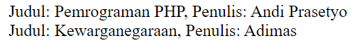
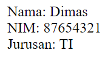
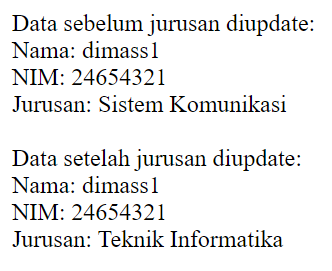
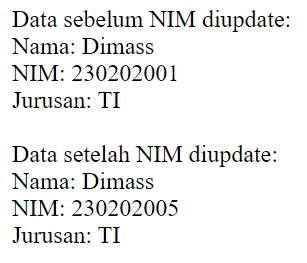

# LAPORAN DOKUMENTASI OOP

Object-Oriented Programming (OOP) adalah sebuah paradigma pemrograman yang berorientasi pada objek. Dalam OOP, kode program diorganisasikan ke dalam unit-unit yang disebut kelas, yang bertindak sebagai cetak biru untuk membuat objek. Setiap objek merupakan entitas yang memiliki atribut (data) dan metode (fungsi) yang memungkinkan interaksi dengan data tersebut. 


## CLASS

Class dalam PHP adalah struktur data atau cetak biru dari suatu objek. Class merupakan konsep dasar dalam pemrograman berbasis objek (OOP) yang berfungsi untuk membuat objek, sehingga pemrograman menjadi lebih efisien dan terstruktur. 


```php
class Mahasiswa
```

## ATRIBUT
atribut adalah property atau karakteristik dari sebuah objek. istilah lain atribut adalah deskripsi sesuatu yang digunakan untuk memanipulasi atau merujuk elemen/bidang/file.\
public adalah atribut yg bersifat public, artinya dapat di akses dari luar.
```php
  public $nama;
  public $nim;
  public $jurusan;
```

## KONSTRUKTOR

konstruktor adalah fungsi khusus yang dijalankan secara otomatis saat objek baru dibuat dari kelas mahasiswa.\
karna atributnya ada 3 yaitu nama,nim,jurusan jadi kita juga membuat 3 konstruktor yang terdiri dari atribut $nama,$nim,$jurusan.

```php
  public function __construct($nama, $nim, $jurusan)
    {
        $this->nama = $nama;
        $this->nim = $nim;
        $this->jurusan = $jurusan;
    }
```

### TAMPILKAN 
nah metode tampilkanInfo() ini adalah kata kunci untuk menampilkan nama,nim,jurusan yang telah kita buat sebelumnya.\
selanjutnya kita membuat objek,disini contoh nya ada 2 yaitu adimas dan akbar.
objek ini harus sesuai dengan fungsi yg kita buat, nama nama ,nim nim, jurusan jurusan.\
setelah itu kita menampilkan objek dengan menggunakan echo, echo mengambil data dari variabel mahasiswa1 / 2\
lalu objek mahasiswa menyesuaikan dengan kata kunci yang ada di fungsi tampilkanInfo().
```php
public function tampilkanInfo()
    {
        return "Nama: $this->nama, Nim: $this->nim, Jurusan: $this->jurusan";
    }
}

$mahasiswa1 = new Mahasiswa("Adimas", "230202001", "D3 Teknik Informatika");
$mahasiswa2 = new Mahasiswa("Akbar", "230202001", "D3 Teknik Informatika");

echo $mahasiswa1->tampilkanInfo();
echo '<br>';
echo $mahasiswa2->tampilkanInfo();
```
### DASAR OOP
```php
<?php
// Definisi Class 
class Buku
{
    // Atribut atau Properties    
    public $judul;
    public $penulis;

    // Constructor 
    public function __construct($judul, $penulis)
    {
        $this->judul = $judul;
        $this->penulis = $penulis;
    }

    // Metode atau Function     
    public function tampilkanInfo()
    {
        return "Judul: $this->judul, Penulis: $this->penulis";
    }
}
// Instansiasi Objek 
$buku1 = new Buku("Pemrograman PHP", "Andi Prasetyo");
$buku2 = new Buku("Kewarganegaraan", "Adimas");
echo $buku1->tampilkanInfo();
echo '<br>';
echo $buku2->tampilkanInfo();

```

hasil : 



## CONSTRUKTOR
```php
<?php
// Membuat class Mahasiswa
class Mahasiswa
{
    // Atribut yang dimiliki oleh class Mahasiswa
    public $nama;
    public $nim;
    public $jurusan;

    // Constructor untuk menginisialisasi atribut
    public function __construct($nama, $nim, $jurusan)
    {
        // Set atribut dengan nilai yang diberikan saat objek dibuat
        $this->nama = $nama;
        $this->nim = $nim;
        $this->jurusan = $jurusan;
    }

    // Metode untuk menampilkan data mahasiswa
    public function tampilkanData()
    {
        // Menampilkan data mahasiswa
        echo "Nama: " . $this->nama . "<br>";
        echo "NIM: " . $this->nim . "<br>";
        echo "Jurusan: " . $this->jurusan . "<br>";
    }
}

// Instansiasi (membuat objek baru) dari class Mahasiswa
$mahasiswa1 = new Mahasiswa("Dimas", "87654321", "TI");

// Memanggil metode tampilkanData() untuk menampilkan data mahasiswa
$mahasiswa1->tampilkanData();
?>

```
hasil : 



## METODE TAMBAHAN
```php
<?php
// Membuat class Mahasiswa
class Mahasiswa
{
    // Atribut yang dimiliki oleh class Mahasiswa
    public $nama;
    public $nim;
    public $jurusan;

    // Constructor untuk menginisialisasi atribut
    public function __construct($nama, $nim, $jurusan)
    {
        // Set atribut dengan nilai yang diberikan saat objek dibuat
        $this->nama = $nama;
        $this->nim = $nim;
        $this->jurusan = $jurusan;
    }

    // Metode untuk menampilkan data mahasiswa
    public function tampilkanData()
    {
        // Menampilkan data mahasiswa
        echo "Nama: " . $this->nama . "<br>";
        echo "NIM: " . $this->nim . "<br>";
        echo "Jurusan: " . $this->jurusan . "<br>";
    }

    // Metode untuk mengubah jurusan mahasiswa
    public function updateJurusan($jurusanBaru)
    {
        // Update jurusan dengan jurusan baru yang diberikan
        $this->jurusan = $jurusanBaru;
    }
}

// Instansiasi (membuat objek baru) dari class Mahasiswa
$mahasiswa1 = new Mahasiswa("dimass1", "24654321", "Sistem Komunikasi");

// Menampilkan data awal mahasiswa
echo "Data sebelum jurusan diupdate:<br>";
$mahasiswa1->tampilkanData();

// Mengubah jurusan mahasiswa menggunakan metode updateJurusan()
$mahasiswa1->updateJurusan("Teknik Informatika");

// Menampilkan data setelah jurusan diupdate
echo "<br>Data setelah jurusan diupdate:<br>";
$mahasiswa1->tampilkanData();
?>

```
hasil : 

## ATRIBUT DAN METODE
```php
<?php
// Membuat class Mahasiswa
class Mahasiswa
{
    // Atribut yang dimiliki oleh class Mahasiswa
    public $nama;
    public $nim;
    public $jurusan;

    // Constructor untuk menginisialisasi atribut
    public function __construct($nama, $nim, $jurusan)
    {
        // Set atribut dengan nilai yang diberikan saat objek dibuat
        $this->nama = $nama;
        $this->nim = $nim;
        $this->jurusan = $jurusan;
    }

    // Metode untuk menampilkan data mahasiswa
    public function tampilkanData()
    {
        // Menampilkan data mahasiswa
        echo "Nama: " . $this->nama . "<br>";
        echo "NIM: " . $this->nim . "<br>";
        echo "Jurusan: " . $this->jurusan . "<br>";
    }

    // Metode setter untuk mengubah nilai nim
    public function setNim($nimBaru)
    {
        // Update nim dengan nim baru yang diberikan
        $this->nim = $nimBaru;
    }
}

// Instansiasi (membuat objek baru) dari class Mahasiswa
$mahasiswa1 = new Mahasiswa("Dimass", "230202001", "TI");

// Menampilkan data awal mahasiswa
echo "Data sebelum NIM diupdate:<br>";
$mahasiswa1->tampilkanData();

// Mengubah nilai NIM menggunakan metode setNim()
$mahasiswa1->setNim("230202005");

// Menampilkan data setelah NIM diupdate
echo "<br>Data setelah NIM diupdate:<br>";
$mahasiswa1->tampilkanData();
?>


```
hasil : 
