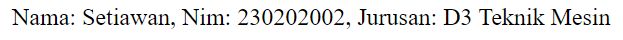

# LAPORAN DOKUMENTASI OOP

Object-Oriented Programming (OOP) adalah sebuah paradigma pemrograman yang berorientasi pada objek. Dalam OOP, kode program diorganisasikan ke dalam unit-unit yang disebut kelas, yang bertindak sebagai cetak biru untuk membuat objek. Setiap objek merupakan entitas yang memiliki atribut (data) dan metode (fungsi) yang memungkinkan interaksi dengan data tersebut. 


## CLASS

class ini ibarat template untuk membuat objek agar objek ini mempunyai atribut dan perilaku yang sama.

```php
class Mahasiswa
```

## ATRIBUT
atribut adalah property atau karakteristik dari sebuah objek.\
public adalah atribut yg bersifat public, artinya dapat di akses dari luar.
```php
  public $nama;
  public $nim;
  public $jurusan;
```

## KONSTRUKTOR

konstruktor adalah fungsi khusus .\
karna atributnya ada 3 yaitu nama,nim,jurusan jadi kita juga membuat 3 konstruktor yang terdiri dari atribut $nama,$nim,$jurusan.

```php
  public function __construct($nama, $nim, $jurusan)
    {
        $this->nama = $nama;
        $this->nim = $nim;
        $this->jurusan = $jurusan;
    }
```

### TAMPILKAN 
nah metode tampilkanInfo() ini adalah kata kunci untuk menampilkan nama,nim,jurusan yang telah kita buat sebelumnya.\
selanjutnya kita membuat objek,disini contoh nya ada 2 yaitu adimas dan akbar.
objek ini harus sesuai dengan fungsi yg kita buat, nama nama ,nim nim, jurusan jurusan.\
setelah itu kita menampilkan objek dengan menggunakan echo, echo mengambil data dari variabel mahasiswa1 / 2\
lalu objek mahasiswa menyesuaikan dengan kata kunci yang ada di fungsi tampilkanInfo().
```php
public function tampilkanInfo()
    {
        return "Nama: $this->nama, Nim: $this->nim, Jurusan: $this->jurusan";
    }
}

$mahasiswa1 = new Mahasiswa("Adimas", "230202001", "D3 Teknik Informatika");
$mahasiswa2 = new Mahasiswa("Akbar", "230202001", "D3 Teknik Informatika");

echo $mahasiswa1->tampilkanInfo();
echo '<br>';
echo $mahasiswa2->tampilkanInfo();
```
### CLASS AND OBJECT
```php
<?php
class Mahasiswa
//pertama harus membuat class atau kelas, class ini ibarat template untuk membuat objek mahasiswa agar mahasiswa ini mempunyai atribut dan perilaku yang sama
//karna yang diminta adalah kelas mahasiswa jadi kita membuat kelas dengan nama class mahasiswa
{
    //selanjutnya kita membuat atribut di dalam kelas
    //karna yang diminta di soal adalah atribut nama,nim,jurusan jadi kita membuatnya sesuai dengan jobsheet
    //public adalah atribut yg bersifat public, artinya dapat di akses dari luar   
    public $nama;
    public $nim;
    public $jurusan;

    //konstruktor adalah fungsi khusus yang dijalankan secara otomatis saat objek baru dibuat dari kelas mahasiswa.
    //karna atributnya ada 3 yaitu nama,nim,jurusan jadi kita juga membuat 3 konstruktor yang terdiri dari atribut $nama,$nim,$jurusan
    public function __construct($nama, $nim, $jurusan)
    {
        $this->nama = $nama;
        $this->nim = $nim;
        $this->jurusan = $jurusan;
    }


    //selanjutnya kita membuat metode/fungsi
    //nah metode tampilkanInfo() ini adalah kata kunci untuk menampilkan nama,nim,jurusan yang telah kita buat sebelumnya
    public function tampilkanInfo()
    {
        return "Nama: $this->nama, Nim: $this->nim, Jurusan: $this->jurusan";
    }
}
//selanjutnya kita membuat objek,disini contoh nya ada 2 yaitu adimas dan akbar
//objek ini harus sesuai dengan fungsi yg kita buat, nama nama ,nim nim, jurusan jurusan 
$mahasiswa1 = new Mahasiswa("Adimas", "230202001", "D3 Teknik Informatika");
$mahasiswa2 = new Mahasiswa("Akbar", "230202001", "D3 Teknik Informatika");
//setelah itu kita menampilkan objek dengan menggunakan echo, echo mengambil data dari variabel mahasiswa1 / 2
//lalu objek mahasiswa menyesuaikan dengan kata kunci yang ada di fungsi tampilkanInfo() 
echo $mahasiswa1->tampilkanInfo();
echo '<br>';
echo $mahasiswa2->tampilkanInfo();

```

hasil : 


## ENCAPSULATION
```php
<?php
class Mahasiswa
//pertama harus membuat class atau kelas, class ini ibarat template untuk membuat objek mahasiswa agar mahasiswa ini mempunyai atribut dan perilaku yang sama
//karna yang diminta adalah kelas mahasiswa jadi kita membuat kelas dengan nama class mahasiswa
{
    //selanjutnya kita membuat atribut atau variabel di dalam kelas
    //karna yang diminta di soal adalah atribut nama,nim,jurusan jadi kita membuatnya sesuai dengan jobsheet
    //private merupakan atribut yg bersifat private, artinya hanya dapat diakses dari dalam kelas itu sendiri, bukan dari luar   
    private $nama;
    private $nim;
    private $jurusan;

    //konstruktor adalah fungsi khusus yang dijalankan secara otomatis saat objek baru dibuat dari kelas mahasiswa.
    //karna atributnya ada 3 yaitu nama,nim,jurusan jadi kita juga membuat 3 konstruktor yang terdiri dari atribut $nama,$nim,$jurusan 
    public function __construct($nama, $nim, $jurusan)
    {
        $this->nama = $nama;
        $this->nim = $nim;
        $this->jurusan = $jurusan;
    }

    //selanjutnya getter untuk mengambil nilai pada atribut
    public function getNama()
    {
        return $this->nama;
    }

    public function getNim()
    {
        return $this->nim;
    }

    public function getJurusan()
    {
        return $this->jurusan;
    }

    //selanjutnya setter untuk mengatur nilai pada atribut
    public function setNama($nama)
    {
        $this->nama = $nama;
    }

    public function setNim($nim)
    {
        $this->nim = $nim;
    }

    public function setJurusan($jurusan)
    {
        $this->jurusan = $jurusan;
    }

    //selanjutnya kita membuat metode/fungsi
    //nah metode tampilkanInfo() ini adalah kata kunci untuk menampilkan nama,nim,jurusan yang telah kita buat sebelumnya
    public function tampilkanInfo()
    {
        return "Nama: " . $this->getNama() . ", Nim: " . $this->getNim() . ", Jurusan: " . $this->getJurusan();
    }
}

//selanjutnya kita membuat objek,disini contoh nya yaitu adimas
$mahasiswa1 = new Mahasiswa("Adimas", "230202001", "D3 Teknik Informatika");

//selanjutnya kita menganti/ngeset input nya menggunakan setter, nama set nama, nim set nim, ini hanya contoh ganti nama dan nim
$mahasiswa1->setNama("Setiawan");
$mahasiswa1->setNim("230202002");
$mahasiswa1->setJurusan("D3 Teknik Mesin");

//setelah itu kita menampilkan objek dengan menggunakan echo, echo mengambil data dari objek mahasiswa1 / 2
//lalu objek mahasiswa menyesuaikan dengan kata kunci yang ada di fungsi tampilkanInfo() 
//selanjutnya kita getter untuk mengambil dan menampilkan nilai pada atribut
echo $mahasiswa1->tampilkanInfo();
```
hasil : 



## INHERITANCE
```php
<?php
//pertama harus membuat class atau kelas, class ini ibarat template untuk membuat objek pengguna agar nama ini mempunyai atribut dan perilaku yang sama
//karna yang diminta adalah kelas pengguna jadi kita membuat kelas dengan nama class pengguna
class Pengguna
{
    //kata kunci protected berarti atribut ini bisa diakses oleh kelas itu sendiri dan kelas-kelas yang mewarisinya (kelas anak).
    protected $nama;

    //konstruktor adalah fungsi khusus yang dijalankan secara otomatis saat objek baru dibuat dari kelas pengguna.
    public function __construct($nama)
    {
        $this->nama = $nama;
    }

    //getNama merupakan metode untuk mendapatkan nama
    public function getNama()
    {
        return $this->nama;
    }
}

//class dosen merupakan kelas anak yang mewarisi kelas pengguna
//extends pengguna artinya class dosen meliputi semua atribut dan metode dari class pengguna
class Dosen extends Pengguna
{
    //atribut $matakuliah adalah atribut tambahan yang sesuai permintaan jobsheet
    //private merupakan atribut yg bersifat private, artinya hanya dapat diakses dari dalam kelas itu sendiri, bukan dari luar
    private $mataKuliah;

    //konstruktor adalah fungsi khusus yang dijalankan secara otomatis saat objek baru dibuat dari kelas dosen.
    //public adalah atribut yg bersifat public, artinya dapat di akses dari luar
    public function __construct($nama, $mataKuliah)
    {
        //parent::__construct($nama) digunakan untuk memanggil metode atau konstruktor dari kelas induk (pengguna) di dalam kelas anak (dosen).
        parent::__construct($nama);
        $this->mataKuliah = $mataKuliah;
    }

    //public function getMataKuliah() adalah metode untuk mendapatkan mata kuliah
    public function getMataKuliah()
    {
        return $this->mataKuliah;
    }

    //public function tampilkanDataDosen() metode untuk menampilkan data dosen
    public function tampilkanDataDosen()
    {
        return "Nama Dosen: " . $this->getNama() . ", Mata Kuliah: " . $this->getMataKuliah();
    }
}

//selanjutnya instansiasi objek dari kelas Dosen
$dosen1 = new Dosen("Pak Abdau", "Pemrograman Web");

// Menampilkan data dosen menggunakan echo
//karna objek nya hanya ada dosen1 jadi kita menampilkan nya hanya 1, jika ingin ditambah lagi maka membuat variabel dosen2 dst
echo $dosen1->tampilkanDataDosen();

```
hasil : 

## POLYMORPHISM
```php
<?php
//pertama harus membuat class atau kelas, class ini ibarat template untuk membuat objek pengguna agar nama ini mempunyai atribut dan perilaku yang sama
//karna yang diminta adalah kelas pengguna jadi kita membuat kelas dengan nama class pengguna
class Pengguna
{
    public function __construct() {}
    // metode aksesfitur untuk menentukan atau menggambarkan fitury ang dapat diakses oleh objek dari kelas tertentu
    public function aksesFitur()
    {
        return "Akses fitur umum untuk semua pengguna.";
    }
}

// class dosen merupakan class anak dari induk pengguna, extends artinya class dosen mewarisi dari class pengguna
class Dosen extends Pengguna

{
    // public function artinya fungsi nya dapat diakses oleh siapa saja dari luar
    // __construct() guna nya menginisiasi apabila menginstansiasi objek baru maka langsung dijalankan
    public function __construct() {}
    // Implementasi khusus untuk dosen
    public function aksesFitur()
    {
        return "Akses fitur khusus untuk Dosen: Mengelola nilai mahasiswa dan mengajar.";
    }
}

// class mahasiswa merupakan class anak dari induk pengguna, extends artinya class mahasiswa mewarisi dari class pengguna
class Mahasiswa extends Pengguna
{
    public function __construct() {}
    // Implementasi khusus untuk mahasiswa
    public function aksesFitur()
    {
        return "Akses fitur khusus untuk Mahasiswa: Melihat jadwal, mengumpulkan tugas, dan melihat nilai.";
    }
}

// Instansiasi objek dari kelas Pengguna, Dosen, dan Mahasiswa
$pengguna = new Pengguna();
$dosen = new Dosen();
$mahasiswa = new Mahasiswa();

// memanggil metode aksesFitur() dari masing-masing objek dan menampilkannya
echo $pengguna->aksesFitur() . "<br>" . $dosen->aksesFitur() . "<br>" . $mahasiswa->aksesFitur();

```
hasil : 

## ABSTRACTION
```php
<?php
// Membuat class abstrak Pengguna
abstract class Pengguna
{
    // Metode abstrak aksesFitur() yang harus diimplementasikan oleh kelas anak
    abstract public function aksesFitur();
}

// Kelas Mahasiswa yang mengimplementasikan metode aksesFitur() dari kelas Pengguna
class Mahasiswa extends Pengguna
{
    // Implementasi metode aksesFitur() untuk Mahasiswa
    //public adalah atribut yg bersifat public, artinya dapat di akses dari luar
    public function aksesFitur()
    {
        return "Akses fitur untuk Mahasiswa: Melihat jadwal, mengumpulkan tugas, dan melihat nilai.";
    }
}

// Kelas Dosen yang mengimplementasikan metode aksesFitur() dari kelas Pengguna
class Dosen extends Pengguna
{
    // Implementasi metode aksesFitur() untuk Dosen
    //public adalah atribut yg bersifat public, artinya dapat di akses dari luar
    public function aksesFitur()
    {
        return "Akses fitur untuk Dosen: Mengelola nilai mahasiswa dan mengajar.";
    }
}

// Instansiasi objek dari kelas Mahasiswa dan Dosen
$mahasiswa = new Mahasiswa();
$dosen = new Dosen();

// Memanggil metode aksesFitur() dari masing-masing objek dan menampilkannya
echo $mahasiswa->aksesFitur() . "<br>" . $dosen->aksesFitur();

```
hasil : 

